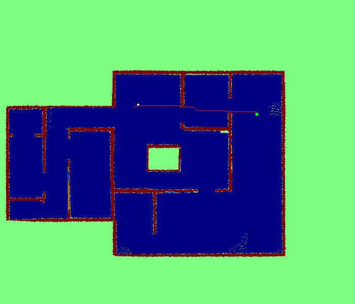

# ROB201 - Maryse Maugenest

  

## Résumé

Ce projet gère l'activité d'un robot dans un environnement prédéfini. Le robot peut :

 - Etre controlé par l'utilisateur si il change l'attribut `use_keyboard` à `True` dans `main.py`
 
 - Aller automatiquement vers le but, tracer le chemin optimal entre le départ et le but, puis revenir au départ en suivant ce chemin.

### Utilisation

Pour compiler le projet, il faut taper la commande `python3 tp_rob201/main.py` depuis le dossier __ROB201__

Pour enregistrer une image, il faut utiliser la touche `s` en ayant sélectionné la fenêtre "verte".

Pour redéfinir le goal pendant le fonctionnement du programme, il suffit de cliquer sur un emplacement valide (c'est à dire de couleur bleue).

Pour quitter le programme, il faut appuyer sur `q` sur une des 2 fenêtres affichées.

### Fonctionnalités

Sur la fenêtre de vision du robot sont affichées:

- La position actuelle du robot en coordonées globales

- La position actuelle du goal en coordonées globales

Lorque le robot fonctionne seul, il retournera au départ via le chemin optimal dés qu'il aura atteint le goal.

Le temps de calcul du chemin avec A* est indiqué dans le terminal.

On peut redéfinir le goal à tout moment par un simple clic.